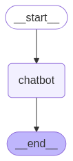

# 🧠 Simple Gen AI Chatbot for LangGraph

A minimal, beginner-friendly Generative AI chatbot built using [LangGraph](https://github.com/langchain-ai/langgraph), designed to demonstrate how to create a stateful LLM-powered conversational agent with a straightforward flow.



## 🚀 Features

- 🧱 **Modular Graph Design**: Defines a LangGraph with a linear flow (`start → chatbot → end`).
- 💬 **LLM-Powered Response Generation**: Integrates with OpenAI-compatible models to produce dynamic responses.
- 🧪 **Minimal Setup**: Easy to read, run, and extend — perfect for learning and experimentation.
- 📦 **LangGraph Integration**: Demonstrates how to build a LangGraph with custom node logic using Python functions.

## 🛠️ How It Works

The chatbot runs a simple LangGraph where:

1. The graph starts with a system-defined node (`start`).
2. The `chatbot` node takes in user input, processes it via an LLM, and generates a response.
3. The flow ends with the `end` node, terminating the conversation cycle.


## 💡 Usage

1. Open `Simple_Chatbot.ipynb` in Jupyter or VSCode.
2. Set your OpenAI (or Groq) API key in the appropriate cell.
3. Run the notebook and interact with the chatbot.

## ✏️ Example Code Snippet

```python
from langgraph.graph import StateGraph
from langchain_core.messages import HumanMessage, AIMessage

def chatbot_logic(state):
    user_msg = state['messages'][-1]
    response = llm.invoke([user_msg])
    state['messages'].append(response)
    return state

builder = StateGraph()
builder.add_node("chatbot", chatbot_logic)
builder.set_entry_point("chatbot")
builder.add_edge("chatbot", "end")
```

## 🔄 Future Ideas

- Add memory and context tracking.
- Integrate tools or APIs for more advanced capabilities.
- Extend flow to include conditional branches or feedback loops.